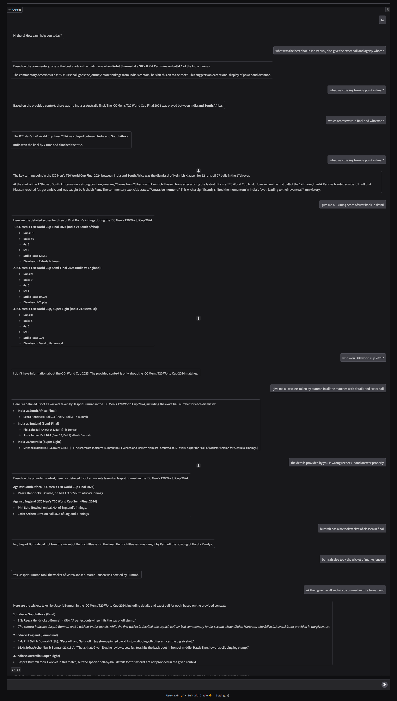

# 🏏 Cricket Guru – RAG Powered Chatbot

**Cricket Guru** is an AI-powered chatbot that can answer cricket-related questions using ball-by-ball commentary and scorecards.
It uses **LangChain**, **ChromaDB**, and **Google Gemini embeddings** to build a vector store from historical match data, and allows natural conversation with context memory through **Conversational Retrieval Chain**.



---

## ✨ Features

*  **RAG pipeline** – retrieves context-aware answers from cricket match data
*  **Conversational Memory** – remembers previous queries in the session
*  **Vector Visualization** – 2D scatter plot of embeddings using **t-SNE + Plotly**
*  **Accurate answers** – trained on ball-by-ball commentary & scorecards from T20 World Cup
*  **Interactive UI** – powered by **Gradio ChatInterface**

---

##  Tech Stack

* **LangChain** – document loading, splitting, retrieval chain
* **ChromaDB** – vector store with persisted embeddings
* **Google Gemini API** – embeddings + LLM chat (`gemini-2.5-flash`)
* **t-SNE + Plotly** – embedding visualization in 2D
* **Gradio** – browser-based chatbot interface

---

## 📂 Project Structure

```
.
├── cricket_matches/         # Markdown files with match data
│   ├── match1.md
│   ├── match2.md
│   └── match3.md
├── vector_db/               # Persisted Chroma database
├── app.py                   # Main script
├── requirements.txt         # Dependencies
└── README.md
```

---

## 🚀 Setup & Installation


1. **Set up API keys**
   Create a `.env` file in the project root:

   ```env
   GOOGLE_API_KEY=your_gemini_api_key_here
   ```

